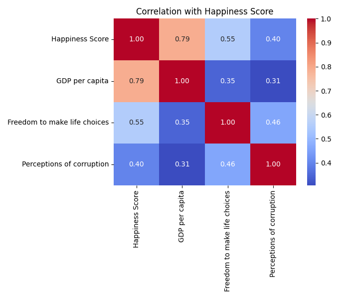
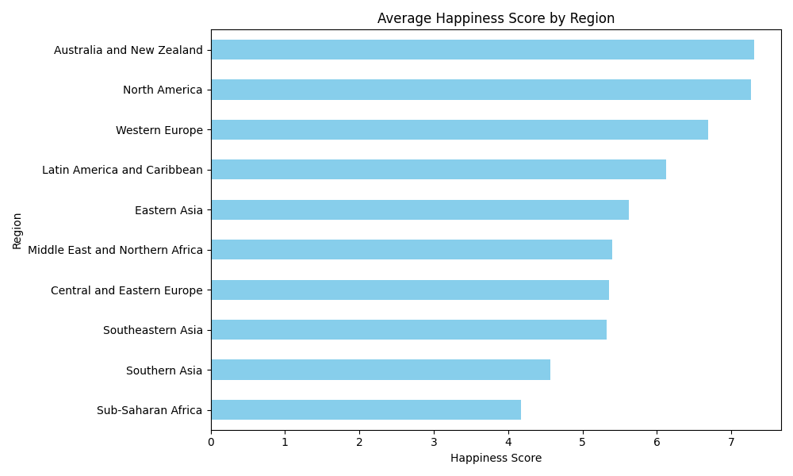

<<<<<<< HEAD
# World Happiness Report Analysis (2015-2019)



## Overview
This project analyzes global happiness trends using the World Happiness Report data from 2015 to 2019. The analysis identifies key factors influencing happiness scores across different regions and explores relationships between happiness and various socio-economic indicators.

## 📊 Key Insights
- **Top Predictors of Happiness**: Social support, GDP per capita, and healthy life expectancy have the strongest positive correlation with happiness scores.
- **Regional Variations**: Western Europe and North America consistently report the highest happiness scores, while Sub-Saharan Africa shows the lowest averages.
- **Impact of Freedom**: Freedom to make life choices shows a strong positive correlation with happiness across all regions.

## 🛠️ Technical Implementation
- **Data Processing**: Merged and cleaned 5 years of World Happiness Report data
- **Analysis**: Performed exploratory data analysis and statistical modeling
- **Visualization**: Created clear, informative visualizations using Matplotlib and Seaborn
- **Tools**: Python, Pandas, Scikit-learn, Matplotlib, Seaborn

## 📂 Project Structure
```
├── merge_happiness_data.py   # Main analysis script
├── world_happiness_report.csv # Merged dataset
├── vizualization/            # Generated visualizations
│   ├── correlation_heatmap.png
│   ├── feature_importance.png
│   ├── happiness_by_region.png
│   ├── pairplot.png
│   └── summary.txt
└── README.md                 # This file
```

## 🚀 Getting Started
1. Clone this repository
2. Install requirements: `pip install pandas numpy matplotlib seaborn scikit-learn`
3. Run the analysis: `python merge_happiness_data.py`

## 📝 Summary of Findings
Detailed findings are available in `vizualization/summary.txt`

## 📊 Sample Visualization


## 📄 License
This project is open source and available under the [MIT License](LICENSE).

## 🤝 Contributing
Contributions, issues, and feature requests are welcome! Feel free to check [issues page]() if you want to contribute.
=======
# world-happiness-analysis
>>>>>>> 20fb002ccf21948c7c60e6f2326a4fa7faa30962
